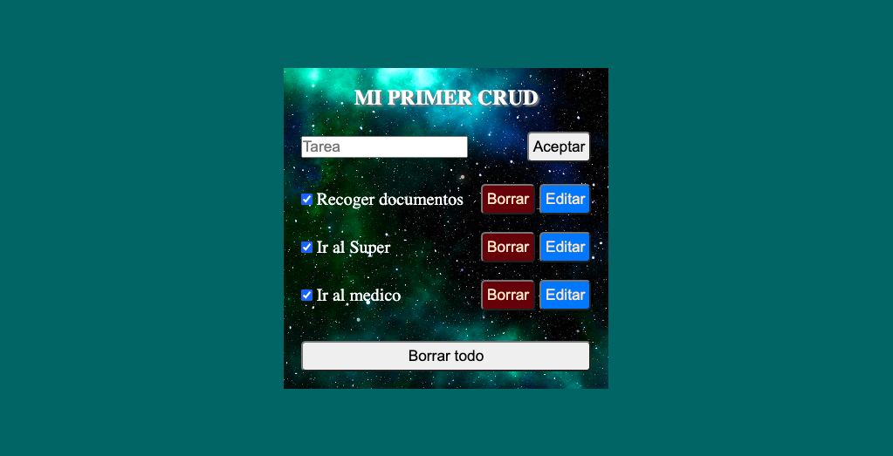

# Aplicación Web de Gestión de Tareas (CRUD)

Este fragmento de código representa una aplicación web simple para gestionar tareas utilizando HTML básico, CSS y JavaScript. La aplicación permite a los usuarios crear, leer, actualizar y borrar tareas. Aquí tienes un resumen del código y su funcionalidad.

## Tabla de Contenidos

Resumen
Previsualización
Estructura HTML
Estilos CSS
Funcionalidad JavaScript

## Resumen

La aplicación proporciona una interfaz para gestionar tareas. Los usuarios pueden crear nuevas tareas, marcarlas como completadas (usando casillas de verificación), editar el contenido de las tareas y borrarlas. Las tareas se almacenan en el almacenamiento local del navegador.

## Estructura HTML

La estructura HTML se divide en las siguientes secciones principales:

<!DOCTYPE html>: Especifica el tipo de documento y la versión de HTML.
<head>: Contiene metadatos y enlaces a recursos externos (estilos y scripts).
<body>: Contiene el contenido visible de la página web.
    
## Estilos CSS
Los estilos CSS se definen en el archivo styles.css proporcionado. Los aspectos clave del estilo incluyen:

Restablecer los márgenes, relleno y modelo de caja predeterminados para todos los elementos.
Establecer un color de fondo para el cuerpo y centrar su contenido.
Estilizar el .crud-container que contiene el contenido principal.
Estilizar la lista de tareas y los botones para editar y borrar tareas.
Funcionalidad JavaScript
La funcionalidad JavaScript se define en el script main.js. Proporciona la interactividad principal para la aplicación:

## El script inicializa la variable id desde el almacenamiento local o la establece en 0 si no está presente.

La función crearTarea crea una nueva tarea y la almacena en el almacenamiento local. Se llama cuando se hace clic en el botón "Aceptar" o se presiona la tecla Enter.
La función mostrarTareas muestra la lista de tareas almacenadas en el almacenamiento local, junto con botones para editar y borrar cada tarea.
La función editar permite editar el contenido de una tarea modificando el valor en el almacenamiento local y luego actualizando la lista de tareas.
La función borrarTodo elimina todas las tareas del almacenamiento local y actualiza la visualización de la lista de tareas.
La función borrar elimina una tarea específica del almacenamiento local y actualiza la visualización de la lista de tareas.
El código demuestra funcionalidad básica CRUD y ofrece una interfaz sencilla para gestionar tareas en el navegador.
